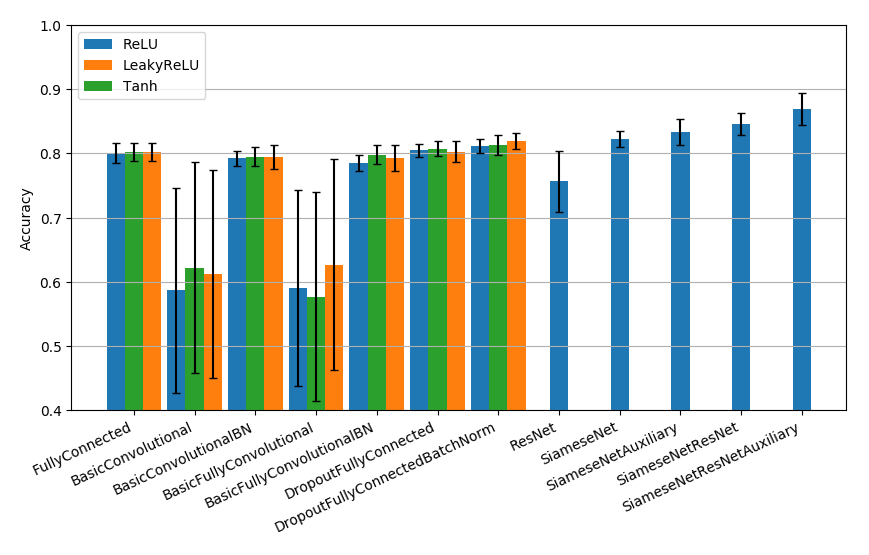
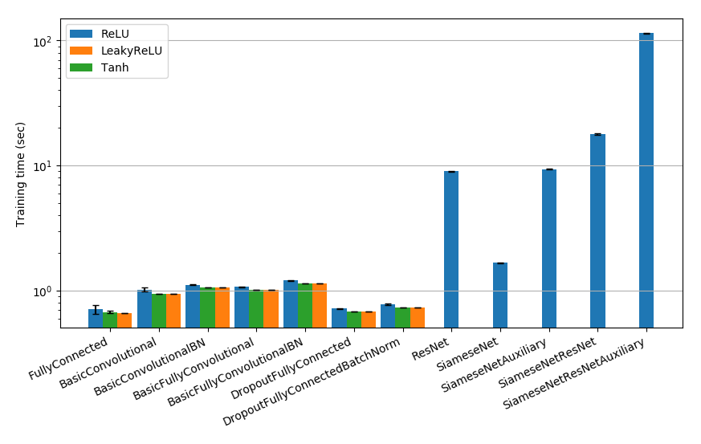
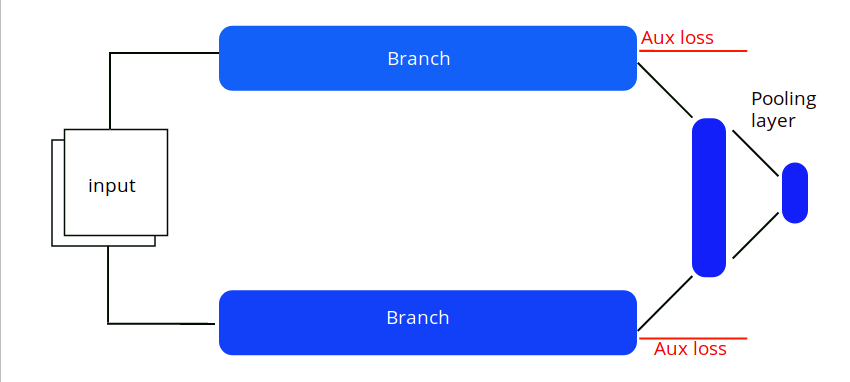

# Deep learning architecture benchmark on MNIST images 
###### deep learning first miniproject


The purpose of this project was:

> given as input a series of [2×14×14] tensor, corresponding to pairs of 14 × 14 grayscale images, it predicts for each pair if the first digit is lesser or equal to the second.


In order to do this, we test several architectures, all described below.

## Libraries used
We used the following libraries for this project, with Python 3.6.8


Computational:

    torch [1.0.1post2]

Graphical (only in plot.py):

    matplotlib.pyplot
    seaborn

Others:

    time
    argparse
    sys
    pandas #only in plot.py


## Prerequisites


The folder structure has to be the following:
```
.
├── data/
    ├── mnist/
├── results/                          # Results cited in report.pdf   
    ├── plots/
    └─ *.csv
├─ test.py                            # Along with all the models *.py
├─ run.py
├─ Report.pdf
└─ README.md
```

## Executables

### run.py

This is the main script. It run 15 experiments (10 if the architecture is complex) over the models and prints (or save) the results. It can be executed without arguments
```
usage: run.py [-h] [-m MODEL] [-o OUTPUT] [-a ACTIVATION_FC]

Reproduction of our results for Project 1

optional arguments:
  -h, --help            show this help message and exit
  -m MODEL, --model MODEL
                        'The model to be tested.'
  -o OUTPUT, --output OUTPUT
                        The output file where to save the results. If deafults
                        print results on screen.
  -a ACTIVATION_FC, --activation_fc ACTIVATION_FC
                        The activation dunction to use in the net. (default:
                        relu)
```
There are several model strings to use as parameter for `run.py`, by default it experiment with each of them if a GPU is available, otherwise it avoids the most complex models, identified with a `+` in the following table. Each of them can also be tested singularly by calling `run.py -m MODEL`.

    'all':                Run all the experiment for all models
    'fcnn':               Fully Connected Neural Network
    'basicconv':          Basic Convolutional net with final FC layer,
    'basicconvbn':        Basic Convolutional net with final FC layer and Batch Normalization,
    'basicfullyconv':     Basic Fully Convolutional net,
    'basicfullyconvbn':   Basic Fully Convolutional net with Batch Normalization,
    'dropoutfc':          Fully Connected Net trained with dropout,
    'dropoutfcbn':        Fully Connected Net with Batch Normalization trained with dropout,
    'resnet':           + Residual Network,
    'siamese':          + Siamese Network with convolutional sub-network,
    'siameseresnet':    + Siamese Network with Residual sub-network.

For all models except the advanced (`+`) ones, the user can specify which activation function to use. It can be specified by running `run.py -m MODEL -a ACTIVATION_FC`, noting that if a model is not specified then all activation functions are tested on all models. Furthermore, if the model is among the complex ones, then ReLU will be used independently of the user choice. The available activation function strings are:

    'relu':       ReLU,
    'leakyrelu':  Leaky ReLU,
    'tanh':       Tanh.

With the `-o` or `--output` parameter, the user can specify where to save the experiment results. If none is given then they are printed in the standard output, while if a file name is given they will be saved in csv format.

<p align="center">

These are the accuracy results we obtained on a 1000 pairs test set, after training the models on a different 1000 pairs train set in 50 epochs.
</p>

### plot.py

This executable takes no arguments and produces plots of the performances of the different architectures. For it to work the files `results_gpu.csv` and `results_cpu.csv` have to be present in the results folder.

<p align="center">

Example of plot. It shows the time required to train the models on a 1000 pairs of images in 50 epochs.
</p>

## Models

### Fully connected

All the FCNN variants are coded in `FullyConnected.py`. We refer to the code for more details.

### Convolutional Networks

Both the basic Convolutional structure with final FC layer and the Fully Connected architecture are coded in `BasicConvolutional.py`, along with their variants with Batch Normalization. We refer to the code for more details.

### Residual Networks

It is implemented in `ResNet.py`.

It has a basic block which takes as input a Tensor of size [12 × 14 × 14], applies a first convolution with a kernel dimension of 5 and a 2-padding (to keep the same height and width), then apply ReLU and one additional convolution with the same properties as before. Finally, the block adds to the latter output the input tensor and apply ReLU. The ResNet takes as input the two images, then applies a first convolution with a kernel size of 1 and 12 output channels. After that it applies 6 of the previous blocks, then averages over the channels, applies ReLU and, finally, applies a fully connected layer which predict the two classes.

We refer to the code for more details.

### SiameseNet

Implemented in `SiameseNet.py`.

The SiameseNet is depicted below, with in white the inputs, in blue the layers and in red the auxiliary losses. The branch shares is the same above and below, and is just represented as 2 entities for convenience, since it is really only one model.

<p align="center">

</p>

The Branch takes as input a [14x14] image as input and output a [10] tensor representing the class to which the number represented in the input belongs.

The pooling layer takes a [20] tensor as input and output a [2] tensor representing (ideally) the class of the pair of grayscale images.

The training with auxiliary losses is as follows, iterating at each epoch:
- first pass the input through the branch and compute the auxiliary losses, and do a backward pass on the branch.
- then do a full forward pass including the pooling layer, and a backward pass trough the pooling layer and the branch.


## Test files

### test.py

In this file we implement the general experiment code, i.e the function to train and test the models and the function to print the results.

### test_SiameseNet.py

This test file is specific to the Siamese network class. Additionally to the other more general one, it output results about the training of the single branches and other information specific to this architecture.

## Authors

* *William Cappelletti*
* *Charles Dufour*
* *Fanny Sue*
