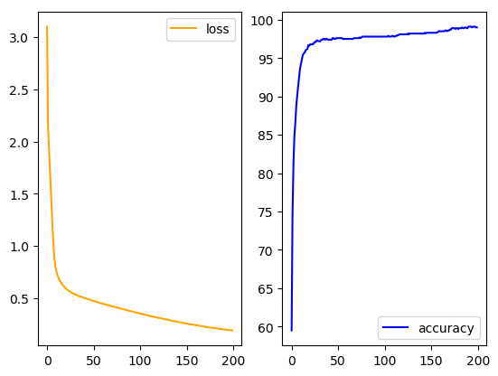
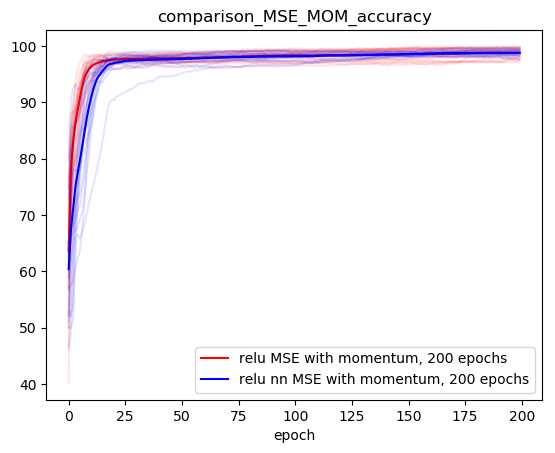

# Second mini project of Deep Learning  

Second project for the course of Deep Learning EE559

The purpose of this project was to write a mini deep learning framework from scratch withouth using `autograd`
## Libraries used
We used the following libraries for this project, with Python 3.6.5

 Computational:

    torch

Graphical:

    matplotlib (as plt)

## Prerequisites

The folder structure has to be the following:

    .
    ├── results                              
        ├── plots
        └── csv
    ├── src                               # Source files
        ├── dl                            # the actual package we wrote
        ├── test_framework.py
        └── test.py
    └── README.md

## Test files

Import functions from `helpers.py`, and `dl`

We train a model with the structure

> two input units, two output units, three hidden layers of 25 units

on the following simulated data as instructed

> training  and  test  set  of  1,000  points each  sampled  uniformly  in  [0,1]x[0,1],
    each  with  a label 0 if outside the disk of radius 1/√2π and 1 inside

results:

### test_framework.py

Import function from `helpers.py`, `dl` and `torch.nn`

This script compares the creation and training of models with our module and with the `torch.nn` module for the same losses,
optimizers and activation functions as above. For example below is the comparison on 20 experiments of the accuracy with CrossEntropy loss.
This will produce these plots where the mean precision over the experiments is in bold and each experiments traces a  merely transparent line.

The plots will be saved in `results/plots/comp_framework`

### test_acti_losses.py

Import functions from `helpers.py`, and `dl`

As before, but we compare our different possible architectures

We compare the performance with `MSE` and `CrossEntropy` losses, `Relu` or `Tanh` acitvation functions,
and we train the models with the vanilla stochastic gradient descent and stochastic gradient with momentum

The results will be saved as `csv` (vizualization of the final state) in `results/csv` and as plots in `results/plots/intra_module_comp` (vizualization of the training).

## Implementation details

The structure of the classes in the module `dl` can be found in `report.pdf`.

We tried to stay as close as possible to the `torch.nn` module. The main differences will be highlighted below.

### Module
`Module` is the abstract class.
### Param
Child of `Module`

Class created in order to store parameter and their gradient in the same structure
### Linear
Child of `Module`

Implementation of a simple linear layer with Xavier's initialization. In order to perform backpropagation it should be given as input the derivative with respect to its output.
### Optimizer
Child of `Module`

Define the optimizer `SGD` (stochastic gradient descent) with the momentum option. The inital momentum is initialized at 0.

### Functionals
Child of `Module`

Define the activation functions `Relu` and `Tanh`. The `forward` and  `backward` functions are used to compute the evaluation and derivative of the activation function. The activation functions "remember" their last input and output in order to make backpropagation easier.

### Sequential
Child of `Module`

Build an usual sequential module as in `torch.nn`

### Criterion
Implementation of the losses. `self.backward()` returns the derivative of the loss wrt to the input. The criterion also remember the last input and target to facilitate the backward pass.

## Authors

* *William Cappelletti*
* *Charles Dufour*
* *Fanny Sue*
